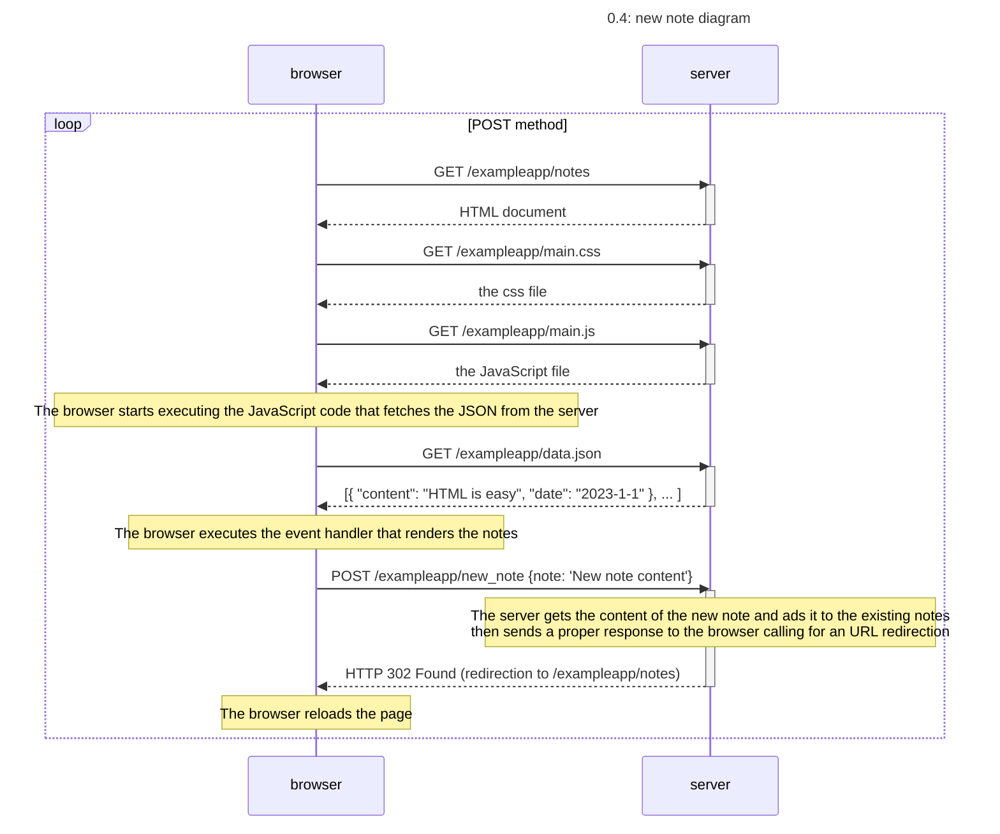

```mermaid
    sequenceDiagram
        Title: 0.4: new note diagram
        
        participant browser
        participant server
        
        loop POST method
            browser->>server: GET /exampleapp/notes
            activate server
            server-->>browser: HTML document
            deactivate server

            browser->>server: GET /exampleapp/main.css
            activate server
            server-->>browser: the css file
            deactivate server

            browser->>server: GET /exampleapp/main.js
            activate server
            server-->>browser: the JavaScript file
            deactivate server

            Note over browser: The browser starts executing the JavaScript code that fetches the JSON from the server

            browser->>server: GET /exampleapp/data.json
            activate server
            server-->>browser: [{ "content": "HTML is easy", "date": "2023-1-1" }, ... ]
            deactivate server

            Note over browser: The browser executes the event handler that renders the notes

            browser->>server: POST /exampleapp/new_note {note: 'New note content'}
            activate server

            Note over server: The server gets the content of the new note and ads it to the existing notes <br>then sends a proper response to the browser calling for an URL redirection

            server-->>browser: HTTP 302 Found (redirection to /exampleapp/notes)
            deactivate server

            Note over browser: The browser reloads the page
        end
```