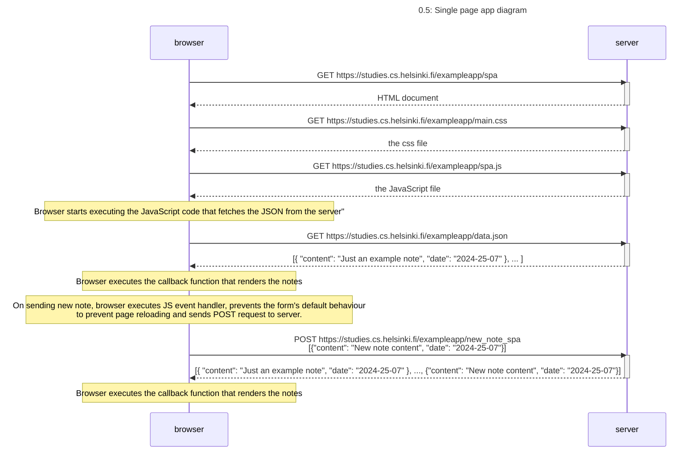

```mermaid
    sequenceDiagram
        Title: 0.5: Single page app diagram
        
        participant browser
        participant server

        browser->>server: GET https://studies.cs.helsinki.fi/exampleapp/spa
        activate server
        server-->>browser: HTML document
        deactivate server

        browser->>server: GET https://studies.cs.helsinki.fi/exampleapp/main.css
        activate server
        server-->>browser: the css file
        deactivate server

        browser->>server: GET https://studies.cs.helsinki.fi/exampleapp/spa.js
        activate server
        server-->>browser: the JavaScript file
        deactivate server

        Note over browser: Browser starts executing the JavaScript code that fetches the JSON from the server"

        browser->>server: GET https://studies.cs.helsinki.fi/exampleapp/data.json
        activate server
        server-->>browser: [{ "content": "Just an example note", "date": "2024-25-07" }, ... ]
        deactivate server

        Note over browser: Browser executes the callback function that renders the notes
        Note over browser: On sending new note, browser executes JS event handler, prevents the form's default behaviour<br />to prevent page reloading and sends POST request to server.

        browser->>server: POST https://studies.cs.helsinki.fi/exampleapp/new_note_spa<br />[{"content": "New note content", "date": "2024-25-07"}]
        activate server 

        server-->>browser: [{ "content": "Just an example note", "date": "2024-25-07" }, ..., {"content": "New note content", "date": "2024-25-07"}]
        deactivate server

        Note over browser: Browser executes the callback function that renders the notes
```